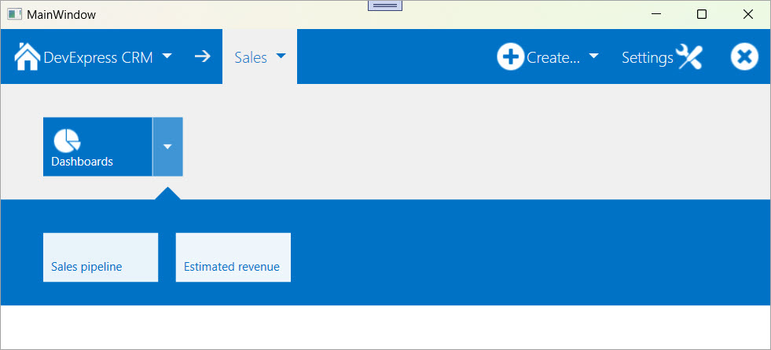

<!-- default badges list -->

[](https://supportcenter.devexpress.com/ticket/details/T326312)
[](https://docs.devexpress.com/GeneralInformation/403183)
[](#does-this-example-address-your-development-requirementsobjectives)
<!-- default badges end -->

# WPF TileNavPane - Display Navigation Buttons and Categories

This example builds a navigation panel using the [`TileNavPane`](https://docs.devexpress.com/WPF/DevExpress.Xpf.Navigation.TileNavPane) control. This control displays default and custom buttons in a navigation bar and defines a category hierarchy populated with nested items.

Use this example to introduce a clean and touch-friendly navigation experience, similar to modern Windows apps. The `TileNavPane` allows you to group navigation commands, display glyphs, and create expandable menus that simplify access to nested views or commands.



## Implementation Details

### Navigation Bar Buttons

The following code example defines four navigation buttons in the [`TileNavPane.NavButtons`](https://docs.devexpress.com/WPF/DevExpress.Xpf.Navigation.TileNavPane.NavButtons) collection:

```csharp
<dxnav:TileNavPane.NavButtons>
    // The "DevExpress CRM" main button
    <dxnav:NavButton Content="DevExpress CRM" 
                     IsMain="True" 
                     Glyph="{dx:DXImageGrayscale Image=Home_32x32.png}" 
                     AllowGlyphTheming="True"/>
    // The "Create..." button with nested items
    <dxnav:NavButton Content="Create..." 
                     HorizontalAlignment="Right" 
                     AllowGlyphTheming="True" 
                     Glyph="{dx:DXImageGrayscale Image=Add_32x32.png}">
        <dxnav:TileNavItem Content="Staff">
            <dxnav:TileNavSubItem Content="Manager"/>
            <dxnav:TileNavSubItem Content="Seller"/>
        </dxnav:TileNavItem>
        <dxnav:TileNavItem Content="Client"/>
    </dxnav:NavButton>
    // The "Settings" button
    <dxnav:NavButton Content="Settings" 
                     GlyphAlignment="Right" 
                     Glyph="{dx:DXImageGrayscale Image=Customization_32x32.png}" AllowGlyphTheming="True" 
                     HorizontalAlignment="Right"/>
    // The button intended to close the panel
    <dxnav:NavButton HorizontalAlignment="Right" 
                     Glyph="{dx:DXImageGrayscale Image=Cancel_32x32.png}" 
                     AllowGlyphTheming="True"/>
</dxnav:TileNavPane.NavButtons>
```

### Navigation Categories and Items

The following code example defines one navigation category in the [`TileNavPane.Categories`](https://docs.devexpress.com/WPF/DevExpress.Xpf.Navigation.TileNavPane.Categories) collection. The category contains a single item with two sub-items:

```csharp
<dxnav:TileNavCategory Content="Sales">
    <dxnav:TileNavItem Content="Dashboards"
                       TileGlyph="{dx:DXImageGrayscale Image=Pie_32x32.png}"
                       AllowGlyphTheming="True">
        <dxnav:TileNavSubItem Content="Sales pipeline"/>
        <dxnav:TileNavSubItem Content="Estimated revenue"/>
    </dxnav:TileNavItem>
</dxnav:TileNavCategory>
```

## Files to Review

* [MainWindow.xaml](./CS/WpfApplication303/MainWindow.xaml) (VB: [MainWindow.xaml](./VB/WpfApplication303/MainWindow.xaml))
* [MainWindow.xaml.cs](./CS/WpfApplication303/MainWindow.xaml.cs) (VB: [MainWindow.xaml.vb](./VB/WpfApplication303/MainWindow.xaml.vb))

## Documentation

* [NavButtons](https://docs.devexpress.com/WPF/DevExpress.Xpf.Navigation.TileNavPane.NavButtons)
* [TileNavPane](https://docs.devexpress.com/WPF/DevExpress.Xpf.Navigation.TileNavPane)
* [TileNavCategory](https://docs.devexpress.com/WPF/DevExpress.Xpf.Navigation.TileNavCategory)
* [Categories](https://docs.devexpress.com/WPF/DevExpress.Xpf.Navigation.TileNavPane.Categories)

## More Examples

* [WPF TileBar – Bind Items to a ViewModel Collection (MVVM)](https://github.com/DevExpress-Examples/wpf-tilebar-generate-items-from-view-model-collection)
* [WPF Tiles - Create Windows-inspired Tile Layout](https://github.com/DevExpress-Examples/wpf-create-tile-layout-control)

<!-- feedback -->
## Does This Example Address Your Development Requirements/Objectives?

[](https://www.devexpress.com/support/examples/survey.xml?utm_source=github&utm_campaign=wpf-tilenavpane-display-nav-buttons-and-categories&~~~was_helpful=yes) [](https://www.devexpress.com/support/examples/survey.xml?utm_source=github&utm_campaign=wpf-tilenavpane-display-nav-buttons-and-categories&~~~was_helpful=no)

(you will be redirected to DevExpress.com to submit your response)
<!-- feedback end -->
